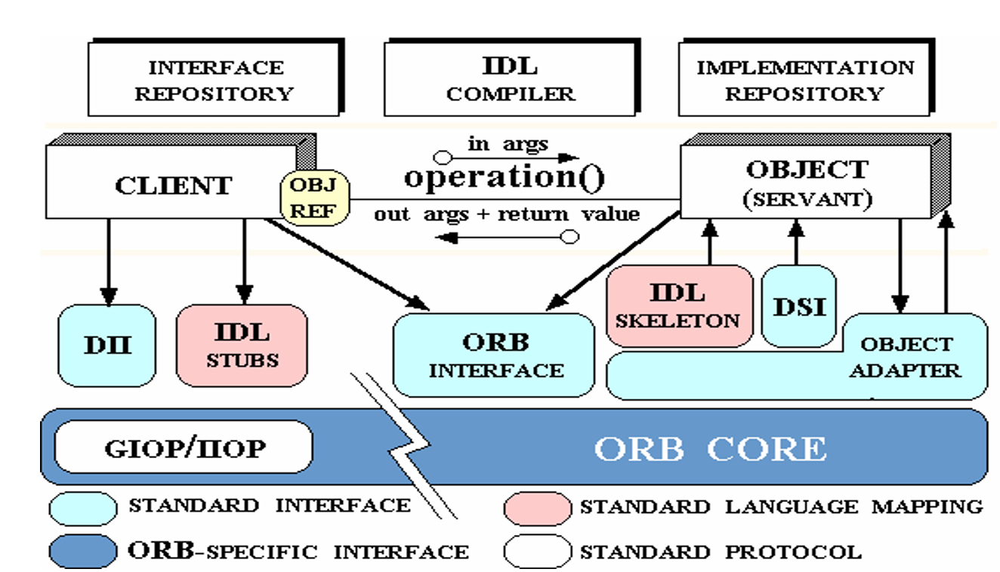

# Distributed-Room-Reservation-System-using-CORBA

The Distributed Room Reservation System is a distributed system that allows the Administrators to manage rooms by creating and deleting according to their availability. It allows the Students to manage their bookings by letting them book, cancel and check available rooms.

The system uses **CORBA** with Java IDL to facilitate the communication between remote objects in heterogonous environment. It also uses UDP connection to communicate and get available timeslots from peer servers.

## CORBA

The Common Object Request Broker Architecture (CORBA) is an architecture and standard defined by the Object Management Group (OMG) for creating, distributing, and managing distributed program objects in a network.
CORBA facilitates communication between software written in different languages and running on different computers. Using CORBA, developers can ignore the specific implementation details from specific operating systems, programming languages, and hardware platforms. The method-call semantic between application objects residing either in the same or remote address spaces are normalized by CORBA (Same host or remote host).
CORBA uses an Interface definition language (IDL) to specify the interfaces that objects present to the implementations outside. CORBA then specifies a mapping from IDL to a specific implementation language like C++ or Java.

## Architecture

There are 3 campuses namely Dorval-Campus ( DVL), Kirkland-Campus (KKL) and Westmount-Campus (WST). Each Campus is assigned a Server. The Clients i.e. the Students and the Admins have varying accessibility. The Admins can either Create a room or Delete a room whereas the Students can Book a room, get available Time-Slots and Cancel the booking.

The Student and the Admin are represented by respective classes. These classes can call remote methods present on the server through CORBA. Each student is associated with a particular campus which is known by the User Id. To get available Time-Slots present on other servers, the server associated with the student has to communicate with them using UDP Connection.

